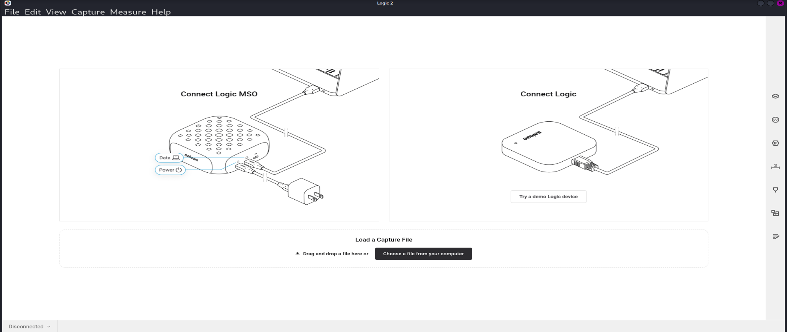
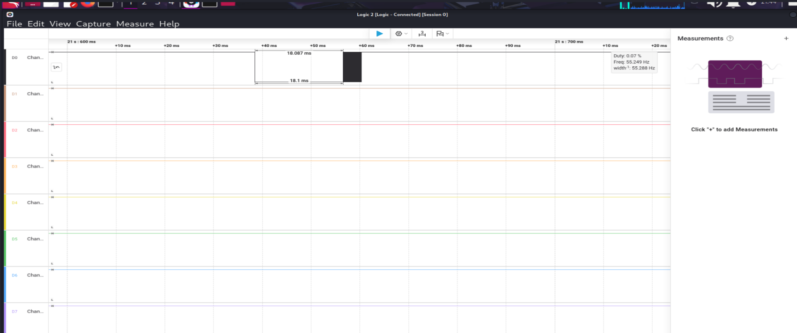
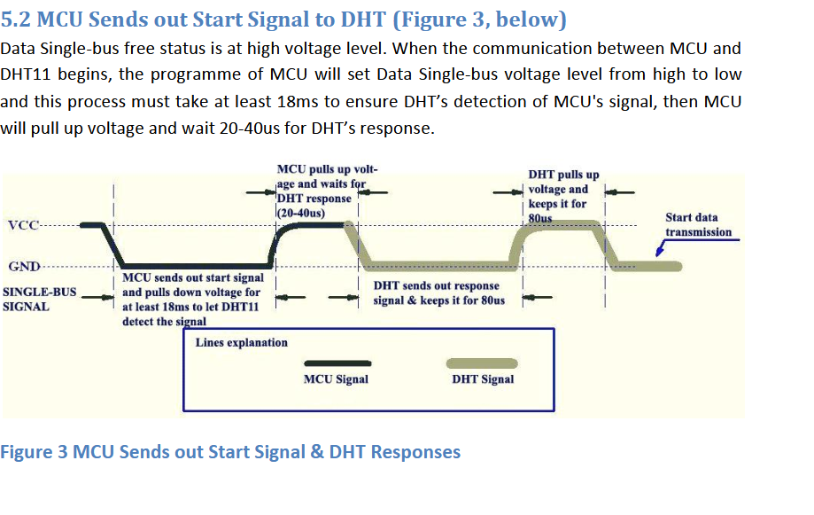
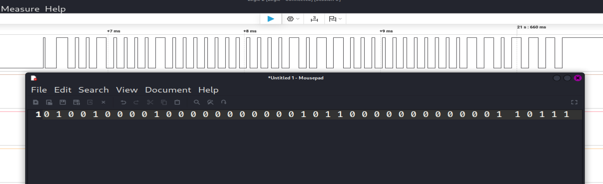
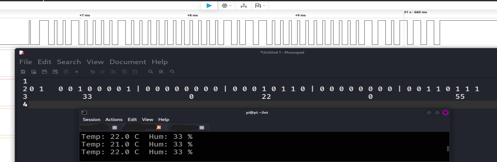

# USB Logic Analyzer (24 MHz, 8-Channel) — Practical Usage and Analysis

## Overview
This project demonstrates the use of a USB Logic Analyzer (24 MHz, 8-channel) to capture and analyze digital signals in embedded systems.

The objective is to understand:
- How a logic analyzer works
- How to correctly connect and use its pins
- How to capture and interpret digital signals using Logic 2 (Saleae)

A DHT11 sensor connected to a Raspberry Pi is used as a practical example to generate and analyze real signals.

---

## What is a Logic Analyzer?

A logic analyzer is a tool used to capture and visualize digital signals from electronic systems.

Unlike an oscilloscope, it focuses on:
- Logic levels (HIGH / LOW)
- Timing relationships
- Communication protocol analysis

---

## Pin Configuration

The USB logic analyzer typically provides:

| Pin | Description |
|-----|------------|
| CH0–CH7 | Digital input channels |
| GND | Ground reference |

### Usage Notes

- GND must always be connected to the circuit ground
- Channels are input-only
- Respect voltage limits (3.3V–5V)
- Multiple channels allow analysis of complex protocols

---

## Setup

### Hardware
- USB Logic Analyzer (24 MHz, 8-channel)
- Raspberry Pi
- DHT11 temperature and humidity sensor

### Software
- Logic 2 (Saleae)
- Python (DHT11 reading)

---

## Using Logic 2 Software

### Opening Logic 2

After launching Logic 2, the main interface allows you to:
- Connect the logic analyzer
- Load capture files
- Start a new session



---

### Capturing a Signal

1. Connect GND to circuit ground
2. Connect CH0 to the signal line
3. Start capture in Logic 2
4. Trigger activity on the device



The capture shows the start signal generated by the Raspberry Pi.  
The measured LOW pulse is approximately **18.1 ms**, which matches the DHT11 protocol requirement.

---

## Reading Data from DHT11 (Raspberry Pi)

To generate the signal, the Raspberry Pi reads data from the DHT11 sensor using Python.

```python
import Adafruit_DHT

sensor = Adafruit_DHT.DHT11
pin = 4

humidity, temperature = Adafruit_DHT.read_retry(sensor, pin)

print("Temp:", temperature, "C")
print("Hum:", humidity, "%")
````

When this code runs:

* The Raspberry Pi sends a **start signal**
* The DHT11 responds with data
* This communication is captured by the logic analyzer

Example output:

```
Temp: 22.0 C
Hum: 33 %
```

---

## DHT11 Protocol (Reference)



The communication sequence:

* Raspberry Pi pulls line LOW for ≥18 ms
* Waits 20–40 µs
* DHT11 responds with:

  * 80 µs LOW
  * 80 µs HIGH
* Then sends a 40-bit data frame

---

## Captured Data Transmission



The signal shows a sequence of pulses:

* Short HIGH pulse → 0
* Long HIGH pulse → 1

---

## Data Decoding

Captured binary:

```
00100001 00000000 00010110 00000000 00110111
```

Converted values:

* Humidity = 33%
* Temperature = 22°C
* Checksum = 55

Verification:

```
33 + 0 + 22 + 0 = 55
```



The decoded values match the Raspberry Pi output, confirming the accuracy of the capture.

---

## Key Considerations

* Ensure proper grounding
* Respect voltage limits
* Use appropriate sampling rate
* Avoid unstable connections

---

## Security Perspective

A logic analyzer can be used for:

* Reverse engineering communication protocols
* Intercepting unencrypted signals
* Hardware-level security analysis

This experiment shows that DHT11 communication is not encrypted and can be observed externally.

---

## Conclusion

The USB Logic Analyzer is an essential tool for:

* Debugging embedded systems
* Understanding digital communication
* Performing low-level hardware analysis

This project demonstrates its practical application using a real sensor communication scenario.

